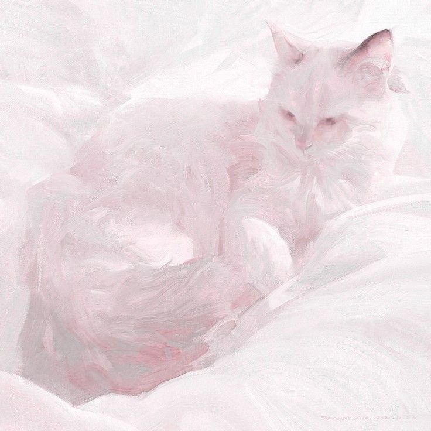
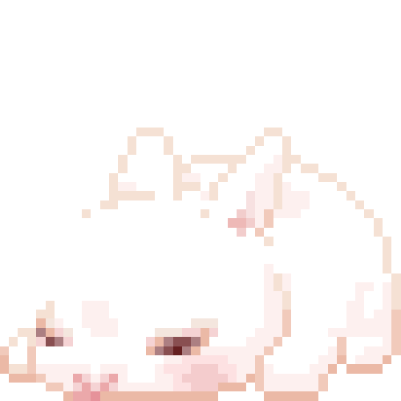

<!--
**KidronLeip/KidronLeip** is a ✨ _special_ ✨ repository because its `README.md` (this file) appears on your GitHub profile.

Here are some ideas to get you started:

- 🔭 I’m currently working on ...
- 🌱 I’m currently learning ...
- 👯 I’m looking to collaborate on ...
- 🤔 I’m looking for help with ...
- 💬 Ask me about ...
- 📫 How to reach me: ...
- 😄 Pronouns: ...
- ⚡ Fun fact: ...

-->

<!-- Banner shouldn't just have name, maybe put quote in banner. Also don't repeat name excessively. -->

 

<!-- Says hello twice here, avoid repetition! -->
<h2 align="center" alt="Hello!"> 𝒜𝒷𝑜𝓊𝓉 𝑀𝑒 </h2>
  
  
Hello! I'm a web designer and developer with a background in graphic design, where I care just as much about how something looks as how it works. I've had the chance to build and redesign a few websites for real clients, and I'm always looking to do more. 
  Outside of the browser, I love to draw traditionally and digitally, follow the cosmetics world closer than I should, and I'm probably rewatching Deep Space Nine for the seventh time right now. 🖖

   
   
   
   
   
   

  

    
  

   

<!--   -->
<!--   -->

<h2 align="center" alt="Skills & Tools"> 𝒮𝓀𝒾𝓁𝓁𝓈 & 𝒯𝑜𝑜𝓁𝓈 </h2>
  
    

    <!-- <h3>Design</h3> -->
    
    
      
    
    
    
  

  

    <!-- <h3 align="center">Languages</h3>  -->
    
    
    
    
  

